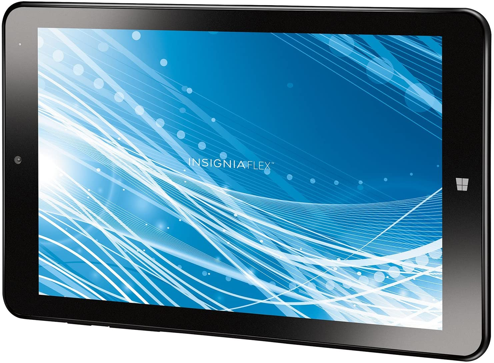

# [Android-x86](https://www.android-x86.org) on the [Insignia Flex8](https://www.insigniaproducts.com/pdp/NS-P08W7100/5451211)

This repository contains kernel patches, scripts and more that I've utilized to get Android-x86 running on a Insignia Flex8 [NS-P08W7100] tablet.

To build from source, follow the instructions at [Android-x86.org](https://www.android-x86.org/source.html)
Based off [Kernel 4.18](https://osdn.net/projects/android-x86/scm/git/kernel/tree/kernel-4.18/)

## Select a build for more info:

## [Android-x86-9.0r2](https://github.com/ouija/android-x86_insignia_flex8/tree/master/Android-x86-9.0r2) -- under development, more info soon
## [Android-x86-8.1r2](https://github.com/ouija/android-x86_insignia_flex8/tree/master/Android-x86-8.1r2)
