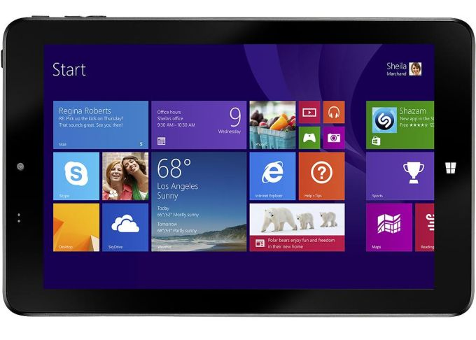

# [Android-x86](https://www.android-x86.org) on the [Insignia Flex 8](https://www.insigniaproducts.com/pdp/NS-P08W7100/5451211)

This repository contains kernel patches, scripts and more that I've utilized to get Android-x86_64 running on a Toshiba Encore 2 [WT8-B] tablet.

Please consider [donating](https://paypal.me/djouija) to support this project. Thanks!

----------------------------------------------------------------------------------

## Select a build:

## [Android-x86-8.1r5](./Android-x86-8.1r5)
## [Android-x86-9.0r2](./Android-x86-9.0r2) -- under development, more info soon
